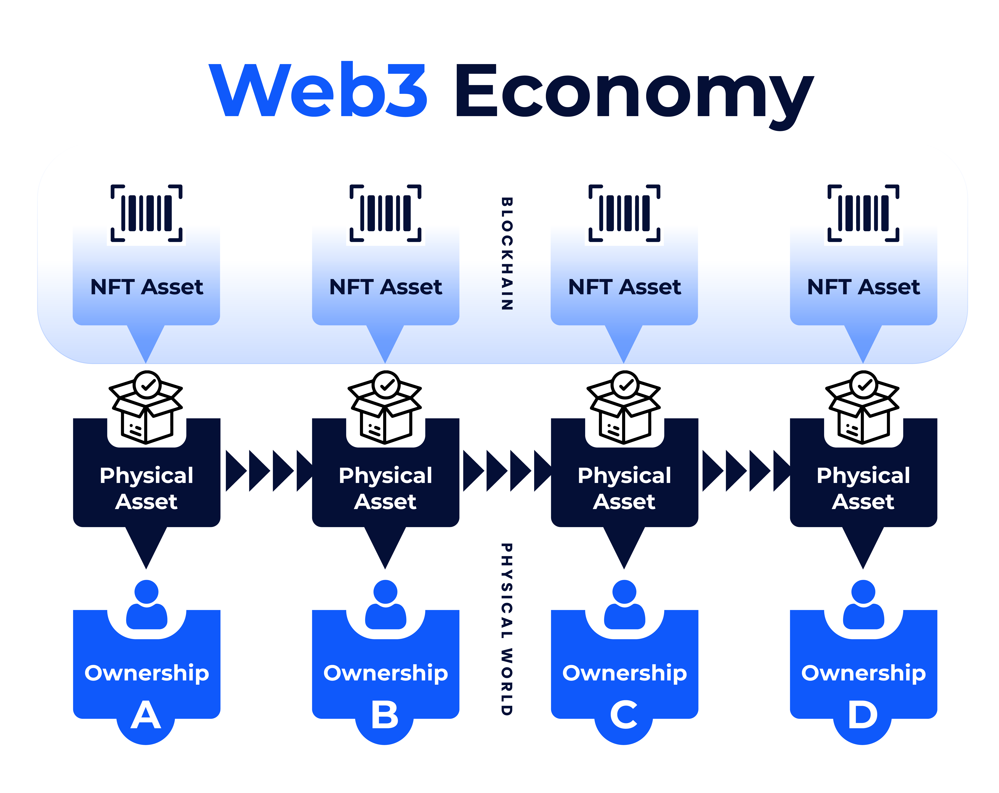

# Vision

Ownify's vision is to create a global web3 inventory where products are embedded on blockchains as digital twins from the manufacturer right up to the final consumer.

It is possible for the same product to be manufactured, shipped, distributed, and sold without going through the centralized inventory of any of the parties involved in the process!
